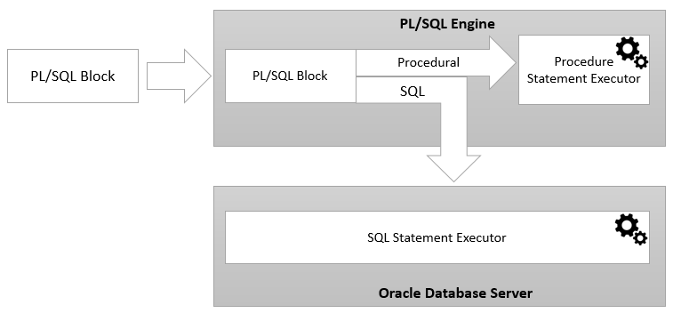

## PL/SQL - ADVANCE SQL

**PL/SQL**
- PL: *Procedural Language extension*
- SQL: *Structural Query Language*

**Kiến trúc**


> Một **PL/SQL Block** được gửi tới PL/SQL Engine để xử lý, còn đoạn SQL sẽ được thực thi ở Oracle DB Server

**Cấu trúc PL/SQL**
- 3 Phần:
    - Declare *(Optional)*
    - Execution ***(Required)***
    - Exception

- Cấu trúc

```
DECLARE
    Khai báo biến
BEGIN
    Bắt đầu chương trình
EXCEPTION
    Xử lý ngoại lệ
END;
```

**Các khối lệnh PL/SQL**

- **Anonymous**
    - Unnamed Block
    - Không được lưu lại trong CSDL
    - Muốn thực thi lại thì **cần viết lại**
    -   
    ```
    [DECLARE]

    BEGIN
        --Statements
    
    [EXCEPTION]

    END;
    ```

- **Procedure**
    - Named Block
    - Gọi lúc nào cũng được
    - 
    ```
    PROCEDURE name
    IS

    BEGIN
        --Statements
    
    [EXCEPTION]

    END;
    ```

- **Function**
    - Giống **Procedure** nhưng phải trả về
    -
    ```
    FUNCTION name
    RETURN datatype
    IS
    BEGIN
        --Statements
        RETURN values;
    
    [EXCEPTION]

    END;
    ```

## Kiểu dữ liệu thông dụng

**Kiểu dữ liệu số**
- `NUMBER`
- `INTEGER`
- `FLOAT`

**Kiểu dữ liệu Text**
- `VARCHAR2`
- `NVARCHAR`

**Kiểu dữ liệu Datetime**
- `DATE`
- `TIMESTAMP`

**Kiểu dữ liệu 1 cột** 
- `%type`

**Kiểu dữ liệu 1 dòng**
- `%Rowtype`

**Kiểu dữ liệu Record**
- `RECORD`

**Kiểu dữ liệu Table**
- `TABLE`
- Các hàm của kiểu `TABLE`: `DELETE`, `EXISTS`, `COUNT`, `FIRST`, `LAST`, `NEXT`, `PRIOR`